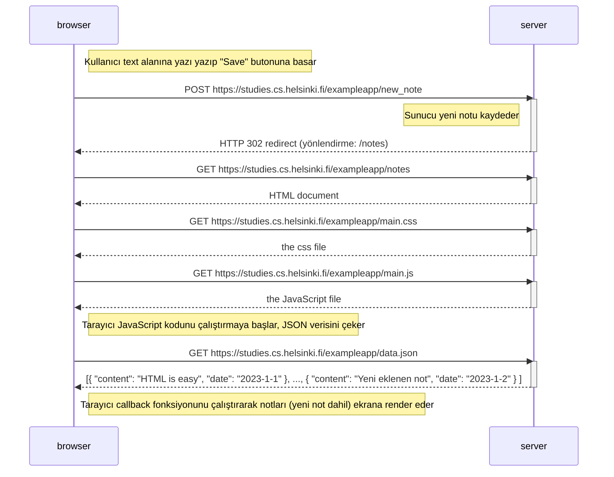

```mermaid
sequenceDiagram
    participant browser
    participant server

    Note right of browser: Kullanıcı text alanına yazı yazıp "Save" butonuna basar

    browser->>server: POST https://studies.cs.helsinki.fi/exampleapp/new_note
    activate server
    Note left of server: Sunucu yeni notu kaydeder
    server-->>browser: HTTP 302 redirect (yönlendirme: /notes)
    deactivate server

    browser->>server: GET https://studies.cs.helsinki.fi/exampleapp/notes
    activate server
    server-->>browser: HTML document
    deactivate server

    browser->>server: GET https://studies.cs.helsinki.fi/exampleapp/main.css
    activate server
    server-->>browser: the css file
    deactivate server

    browser->>server: GET https://studies.cs.helsinki.fi/exampleapp/main.js
    activate server
    server-->>browser: the JavaScript file
    deactivate server

    Note right of browser: Tarayıcı JavaScript kodunu çalıştırmaya başlar, JSON verisini çeker

    browser->>server: GET https://studies.cs.helsinki.fi/exampleapp/data.json
    activate server
    server-->>browser: [{ "content": "HTML is easy", "date": "2023-1-1" }, ..., { "content": "Yeni eklenen not", "date": "2023-1-2" } ]
    deactivate server

    Note right of browser: Tarayıcı callback fonksiyonunu çalıştırarak notları (yeni not dahil) ekrana render eder
```