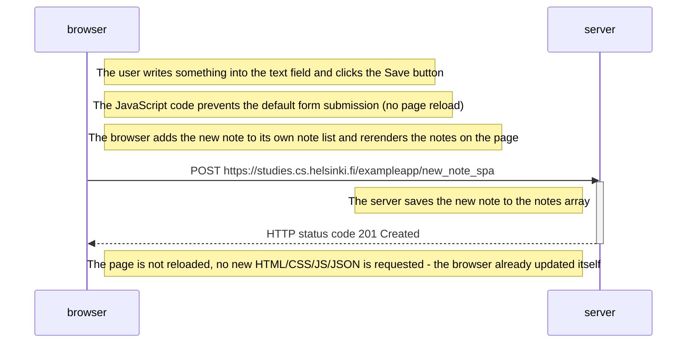

```mermaid
sequenceDiagram
    participant browser
    participant server

    Note right of browser: The user writes something into the text field and clicks the Save button

    Note right of browser: The JavaScript code prevents the default form submission (no page reload)
    Note right of browser: The browser adds the new note to its own note list and rerenders the notes on the page

    browser->>server: POST https://studies.cs.helsinki.fi/exampleapp/new_note_spa
    activate server
    Note left of server: The server saves the new note to the notes array
    server-->>browser: HTTP status code 201 Created
    deactivate server

    Note right of browser: The page is not reloaded, no new HTML/CSS/JS/JSON is requested - the browser already updated itself
```